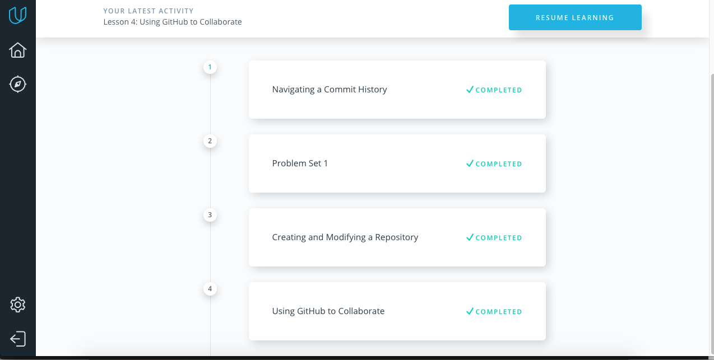
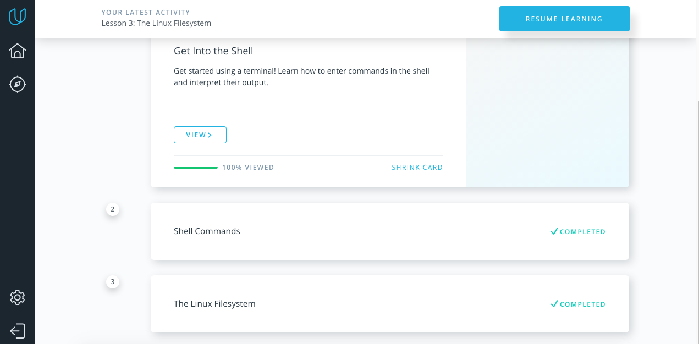
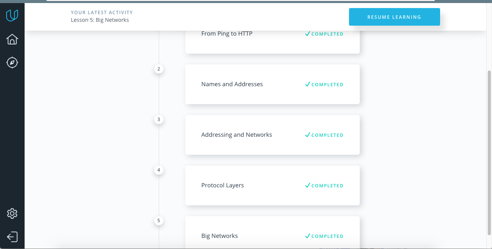
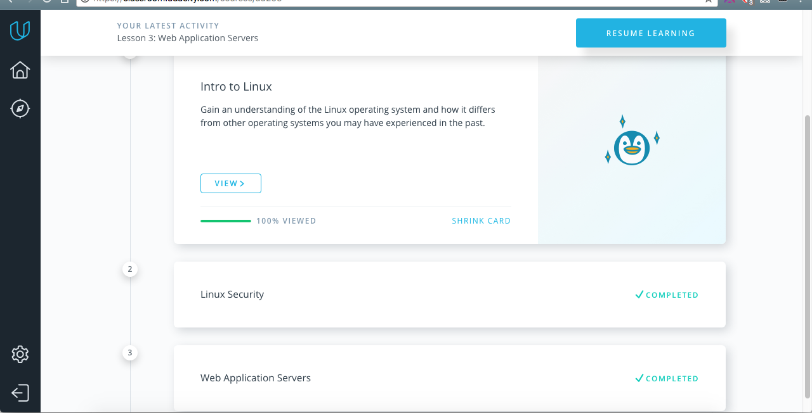
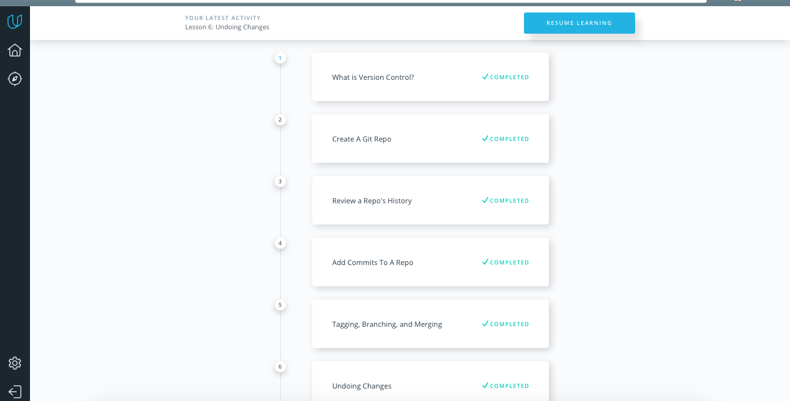
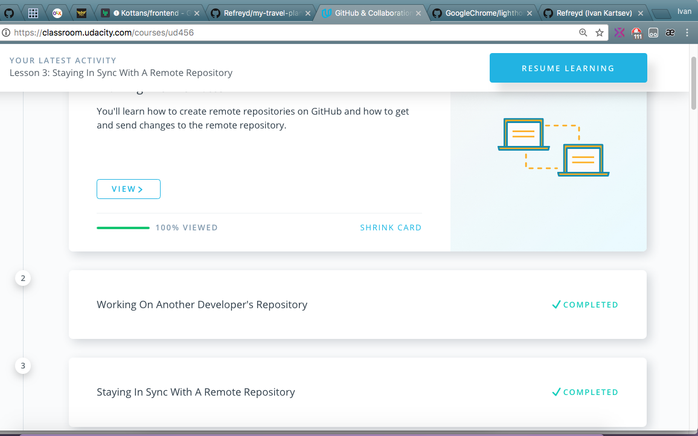

# kottans_frontend

## Task 0
I've just finished "How to use git and Github" and i can say that i've opened new world for me!

It was great experience and there are some new things for me:
* how to operate with Git, 
* commands, 
* interaction with system and Github,
* how to use GitHub to collaborate and work with other peoples in team 

## Task 1

### "Linux Command Line Basics" course

I already had some experience with Linux terminal and Linux filesystem but in this course i've discovered some amazing features like globbing. It was interesting and useful course

### Networking For Web-Developers and Configuring Linux Web Servers courses
For better understanding Networking For Web-Developers and Configuring Linux Web Servers courses, i've used some additional materials. There was a lot of useful information about private keys, ports, users, root and other. Also i've upgraided my networking skills and understanding how it works 

## Task 2

### Version Control with Git
I've discovered some great features and commands from this course (git revert/reset) also it show me that git log is a VERY POWERFUL thing and couple amazing options what can git log do for me

### GitHub & Collaboration 
This one was fine too for me because it helped me dive into Github world and teached me some great features like git rebase.

